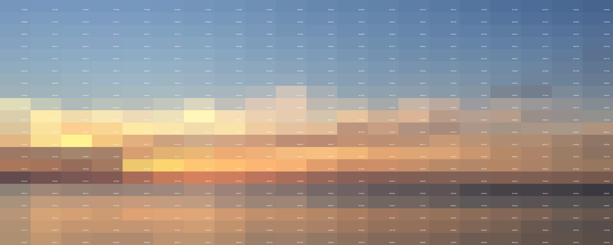

# pixelator
Cut an image into single colour mini card size images

## Requirements

Needs ImageMagick installed on local system

## Docker

Build

    docker build -t pixelator .

Run

    docker run -it -v $INPUT_DIR:/input -v $OUTPUT_DIR:/output pixelator

## Or

Install

    brew install imagemagick

Run

    bundle install

Place image.jpg into directory, run

    ruby main.rb

## Example

### Input Image

  

### Output Image

  

### Individual Output Tile

  

